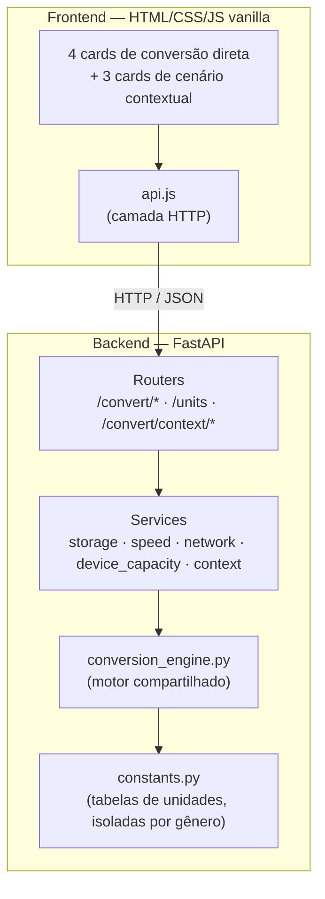

# ByteShift

Conversor de unidades técnicas — armazenamento, velocidade de transferência, banda de rede e capacidade de dispositivos — com a mesma lógica de uma calculadora de câmbio: digite um valor numa unidade, veja o equivalente em todas as outras na hora.

Feito como peça de portfólio, com foco em arquitetura limpa, isolamento de domínio e cobertura de testes — não só "funciona na tela".

## Por quê

A maioria dos conversores de unidade de TI por aí mistura decimal (1000) com binário (1024) sem avisar, o que é a razão de "comprar um HD de 1TB e o Windows mostrar 931GB" confundir tanta gente. O ByteShift trata essa distinção como o conceito central do projeto — inclusive visualmente: laranja sempre marca unidade decimal, roxo sempre marca unidade binária, em toda a interface.

## Funcionalidades

- **4 gêneros de conversão isolados**: Armazenamento, Velocidade de transferência, Banda de rede, Capacidade de dispositivo
- **Capacidade de dispositivo** converte capacidade *anunciada* (decimal, o que vem na caixa) para capacidade *real* (binária, o que o sistema operacional mostra)
- **3 cenários contextuais**: tempo de download, tempo de transferência local, quantos arquivos cabem num dispositivo
- Validação séria: rejeita unidades inválidas, valores negativos, NaN, infinito e overflow — sempre com mensagem clara, nunca um resultado silencioso
- Documentação de API automática via Swagger (`/docs`)

## Arquitetura



**Regra de ouro do projeto**: cada gênero tem sua própria tabela de unidades e sua própria unidade-base interna. Nenhuma função converte "de qualquer coisa para qualquer coisa" — até o motor de conversão compartilhado (`conversion_engine.py`) só existe pra evitar repetir código; ele nunca decide sozinho qual tabela usar, isso é sempre passado explicitamente por cada serviço.

### Estrutura de pastas

```
unit-converter/
├── backend/
│   ├── app/
│   │   ├── main.py              # ponto de entrada, CORS, registro de rotas
│   │   ├── core/
│   │   │   ├── constants.py     # tabelas de unidades por gênero
│   │   │   ├── conversion_engine.py  # motor de conversão compartilhado
│   │   │   ├── exceptions.py    # erros de negócio centralizados
│   │   │   └── validators.py    # validação e arredondamento
│   │   ├── services/            # 1 arquivo por gênero + context_service.py
│   │   ├── routers/             # convert.py, units.py, context.py
│   │   ├── schemas/             # modelos Pydantic (request/response)
│   │   └── tests/               # 63 testes automatizados
│   ├── pyproject.toml
│   └── requirements.txt
└── frontend/
    ├── index.html
    ├── css/main.css              # design tokens + estilos
    └── js/
        ├── config.js             # URL da API por ambiente
        ├── api.js                # comunicação HTTP
        ├── main.js               # bootstrap da página
        └── cards/
            ├── genres.js         # config dos 4 gêneros
            ├── card.js           # template de card de conversão direta
            ├── scenarios.js      # config dos 3 cenários contextuais
            └── scenario-card.js  # template de card de cenário
```

## Como rodar localmente

### Backend

```bash
cd backend
python3 -m venv venv
source venv/bin/activate        # Windows: venv\Scripts\activate
pip install -r requirements.txt
uvicorn app.main:app --reload
```

A API sobe em `http://localhost:8000`. Documentação interativa em `http://localhost:8000/docs`.

Rodar os testes:

```bash
pytest
```

(a configuração de cobertura já vem no `pyproject.toml` — `pytest` sozinho já roda com `--cov`)

### Frontend

Precisa ser servido por um servidor HTTP local — **não abra o `index.html` direto no navegador**, os módulos ES não carregam via `file://`.

```bash
cd frontend
python3 -m http.server 5500
```

Acesse `http://localhost:5500`. Se preferir, qualquer servidor estático serve (Live Server do VS Code, `npx serve`, etc.) — só ajuste a porta na lista de origens do CORS em `backend/app/main.py` se for diferente de 5500/5173.

## Decisões técnicas

- **Isolamento por gênero**: decisão deliberada desde o início do projeto. O custo é mais arquivos; o ganho é que adicionar um 5º gênero no futuro não arrisca quebrar os outros 4.
- **Capacidade de Dispositivo com tabelas assimétricas**: entrada sempre em unidade anunciada (decimal), saída sempre em unidade real (binária) — não faz sentido converter "anunciado para anunciado", então a API nem aceita isso.
- **Validação em duas camadas**: Pydantic barra o formato errado na porta de entrada (422 automático); os serviços validam de novo por dentro (NaN, infinito, overflow) — assim a lógica de negócio continua correta mesmo se chamada diretamente em testes, sem depender do FastAPI estar no meio.
- **Paleta com função, não decoração**: verde é a cor da marca; laranja marca decimal; roxo marca binário — em qualquer card, a cor already ensina o conceito antes da pessoa ler o texto.

## Testes

63 testes automatizados cobrindo os 4 serviços de conversão + o serviço de cenários contextuais + os validadores centralizados: valores conhecidos, decimal vs binário, valores-limite (zero, muito grande, overflow), e todos os casos de erro (unidade inválida, valor negativo, NaN, infinito, divisão por zero).

```bash
cd backend
pytest --cov=app --cov-report=term-missing
```

## Deploy

Ver [DEPLOY.md](./DEPLOY.md) para o passo a passo de publicar o backend (Render/Railway) e o frontend (Vercel/Netlify/GitHub Pages).

**API em produção**: `<preencher depois do deploy>`
**Swagger público**: `<preencher depois do deploy>/docs`
**Frontend em produção**: `<preencher depois do deploy>`

## Roadmap

Projeto construído em 9 fases, do setup do repositório até o deploy — arquitetura, backend, testes, frontend e UX foram todos tratados como etapas próprias, não um "faz tudo de uma vez". Detalhes de cada fase disponíveis no histórico de commits.
